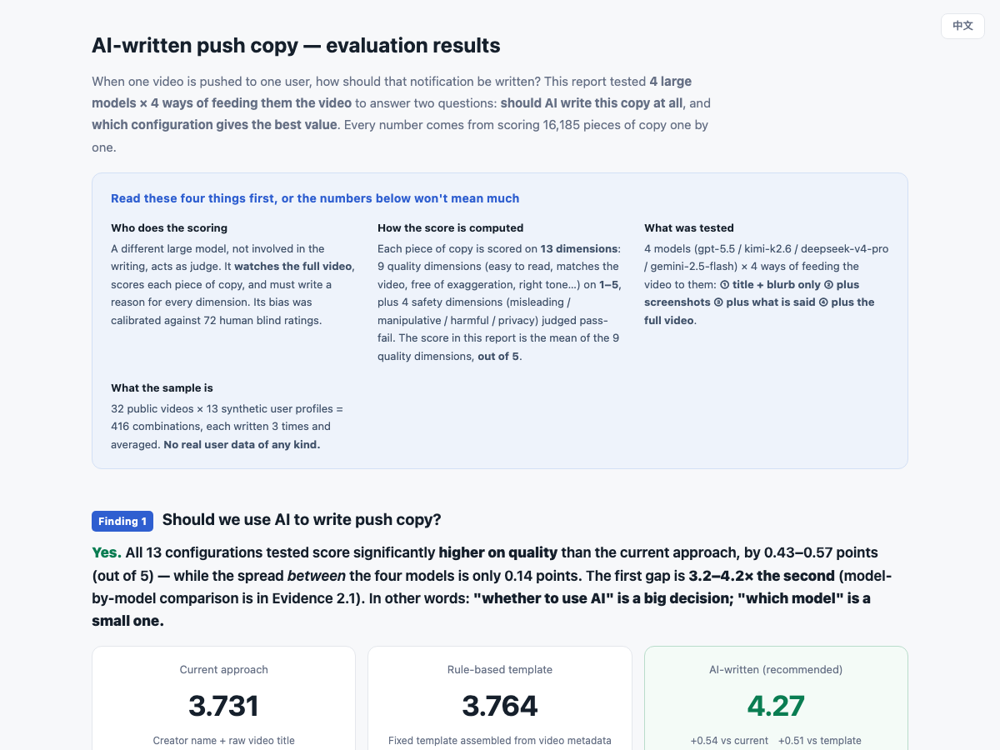
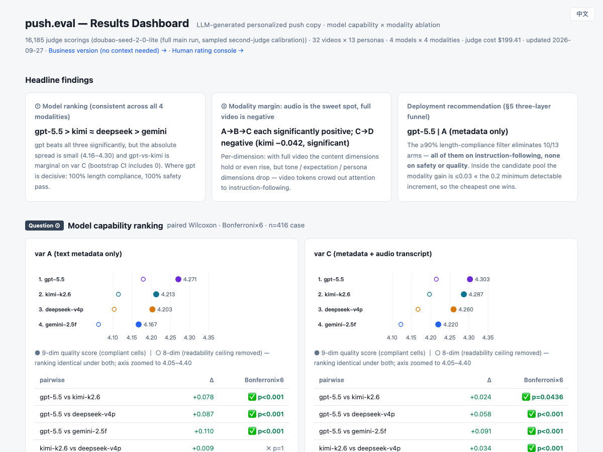

# push.eval

An offline evaluation framework for LLM-generated personalized push notification copy, for a feed-driven short-video consumer app at scale (100M+ users).

**English** · [中文](README.zh-CN.md)

**Jump to:** **[Results — business dashboard](https://dingdugan.github.io/push.eval-public/web/dashboard_biz.html?lang=en)** · [Results — technical dashboard](https://dingdugan.github.io/push.eval-public/web/dashboard.html?lang=en) · [Method — eval design doc](docs/eval-design-doc.en.md)
*(both dashboards have an EN / 中文 toggle in the top-right corner)*

---

## Why this exists

Push is one of the few re-engagement surfaces a feed app fully controls, and its copy is almost always templated — creator name plus the raw video title. An LLM can obviously write something more personal than that. The open questions are **which model**, and **how much of the video the model actually needs to see**. Neither has a public answer, and at this scale both are expensive to get wrong.

Those questions need an *offline* answer, before traffic:

- **Online metrics are a weak proxy for copy quality.** Push CTR moves with content, send timing and user state; isolating the copy's own contribution takes a long and expensive experiment.
- **A bad push is asymmetrically costly.** A user who mutes notifications or uninstalls is effectively unrecoverable, so you cannot A/B your way *through* the bad region to find the good one.
- **The cost spread is a real line item.** Per-generation cost across the configurations measured here spans **65×** ($0.0007 to $0.0440), driven almost entirely by how much video signal the model is fed. At push volume that is a budget decision, so the quality–cost frontier has to be mapped before committing.

So: an offline gate that ranks models on push-copy quality, prices what each additional video signal is worth, and ends in a deployable recommendation.

## What it evaluates

Given a `(video, user_persona)` pair, can an LLM generate push copy that is relevant, personalized, appropriately framed, and safe — across different input modalities and model tiers?

1. **Model capability** — which LLMs are best at this task, and on which dimensions?
2. **Modality ablation** — what is the marginal value of giving the model more video signal? (metadata only → +keyframes → +audio transcription → full video stream)

---

## Key findings

**v0.1 complete.** 16,224 generations and 17,017 LLM-judge scorings (16,185 main run + 832 baseline) across 4 models × 4 input modalities — about **$412 in API spend**, 2026-05 → 2026-09. Statistics: paired Wilcoxon + Bonferroni correction + video-cluster bootstrap.

> Throughout, an **arm** is one `(model, input-modality)` configuration. 13 of the 16 combinations were run — one model is text-only, and the full-video modality was run on two models (see *How it was measured*).

**1 — LLM copy beats both baselines, decisively.** All 13 arms score significantly higher than *both* B0 (the conventional template: creator name + raw video title) and B1 (rule-based metadata template): **+0.43 to +0.57** vs B0, **+0.40 to +0.54** vs B1, on a 9-dimension 1–5 composite. That gap is 3.2–4.2× larger than any gap *between* models or *between* modalities — the first-order decision is "use an LLM at all"; model and modality choice are second-order.

**2 — Model ranking: `gpt-5.5` > `kimi-k2.6` ≈ `deepseek-v4-pro` > `gemini-2.5-flash`**, consistent across modalities, with every pair significant except kimi-vs-deepseek on text-only input. But the spread is narrow (4.16–4.30) — on *writing quality alone*, the four models are close.

**3 — The real differentiator is instruction-following, not writing quality.** The deployment filter ([design doc](docs/eval-design-doc.md) §5.2) requires two things of an arm: a test case counts as safe only when **all three** of its repeated generations clear all four safety checks, and an arm needs ≥95% of cases safe **plus** ≥90% of its outputs inside the character budget. Under that filter **10 of 13 arms are eliminated — every one of them for length, none for safety or quality.** `gpt-5.5` holds 100% length compliance across all its arms; every other arm lands at ≤88.1%. A push slot has a hard character budget, and an over-length body gets truncated in production no matter how well it reads.

**4 — More video signal is not worth its cost.** metadata → +keyframes → +audio each give a significant but tiny gain (+0.02 to +0.06). Feeding the **full video stream is net negative** for `kimi-k2.6` (−0.042, significant, bootstrap-robust). The per-dimension decomposition shows why: with full video, content-fidelity and video-relevance hold or improve, while *tone fit*, *expectation alignment* and *preference match* drop — the video tokens pull attention toward describing the video and crowd out instruction and persona adherence.

**Deployment recommendation** (from the decision rules in design doc §5, executed by `src/decision_rules.py`): **`gpt-5.5` + metadata-only input** — $0.0090 per generation, 100% safety, 100% length compliance. Within the surviving candidate pool the richer modalities gain ≤0.03, far below the 0.2 minimum detectable increment, so their cost premium buys nothing measurable.

> Runner-up worth noting: `kimi-k2.6` + audio-transcript input is Pareto-optimal on *quality × cost alone* (4.287 at $0.0015 — one sixth the cost) and fails only the length filter, at 71.4%. Length is a prompt-layer lever, which makes a "length-constraint hardening" retest the highest-value v0.2 experiment.

### The two dashboards

Same data, two audiences. Both also build as self-contained single files (`*_standalone.html`, data inlined — open directly in a browser, no server needed).

| [**Business-facing →**](https://dingdugan.github.io/push.eval-public/web/dashboard_biz.html?lang=en) | [**Technical →**](https://dingdugan.github.io/push.eval-public/web/dashboard.html?lang=en) |
|---|---|
| [](https://dingdugan.github.io/push.eval-public/web/dashboard_biz.html?lang=en) | [](https://dingdugan.github.io/push.eval-public/web/dashboard.html?lang=en) |
| For a reader with no project context. Conclusion-first, every term explained inline, side-by-side copy comparison (status quo vs rule template vs LLM), the decision funnel, plus limitations and recommended next steps. | For a technical reader. Significance tests, cluster-bootstrap CIs, per-dimension full-video decomposition, Pareto front, and a per-arm drill-down with the judge's written reasoning. |

---

## How it was measured

- **416 test cases** = 32 public YouTube videos (8 official categories × 4) × 13 synthetic user personas. Each case is generated **3 times** per arm and averaged.
- **Models** (execution subset): `gemini-2.5-flash`, `gpt-5.5`, `deepseek-v4-pro`, `kimi-k2.6`.
  - `deepseek-v4-pro` is text-only, so it runs the metadata and audio-transcript arms only; the full-video arm runs on `gemini-2.5-flash` and `kimi-k2.6`. That is what makes 13 arms rather than 16.
  - The design intended `gemini-3.5-flash`; `2.5-flash` was substituted after a sustained vendor-side 503 capacity constraint (design doc §4.2).
- **Judge**: `doubao-seed-2-0-lite` scores all 16,185 outputs against the **full video**, on 13 dimensions (4 binary safety + 9 effect on 1–5), writing a rationale for each. Scores roll up per output → per case → per arm; cross-judge κ sampling against Gemini and Kimi checks agreement (design doc §4.3).
- **Baselines**: B0 reproduces the conventional template (creator name + raw title); B1 is a rule-based metadata template. Both are scored by the same judge under the same rubric.

## Known limitations

The full list is in design doc Appendix A. These three most affect how the findings should be read:

- **Human calibration is under-executed.** The design calls for 330–500 independently sampled human-blind scorings to calibrate the judge. Only the 72-item refine adjudication set was scored, by a single rater (the author). The 104-item stratified audit set and the scoring console (`web/index.html`, audit mode) are built and ready; closing this gap is roughly 2–3 hours of rating work.
  - *What this does affect*: the `content_fidelity` −0.45 bias correction rests on the same sample used to tune the judge's anchors, so its generalization is unverified, and the full-run safety rates are judge-side rather than human-confirmed.
  - *What it does not affect*: the between-arm comparisons. A per-dimension correction subtracts the same constant from every arm, so the rankings, modality deltas and baseline gaps hold regardless of where that constant lands.
- **N = 416 cases resolves differences of ≥0.3 only.** Gaps smaller than that may be reported as "not significant" when a real effect exists. Per-vertical claims (about 4 videos each) are directional, not statistically supported.
- **Latency figures are environment-bound.** Measured over a cross-continent network with inline video upload — usable for relative comparison within this project, not as a statement about vendor production latency.

## Reproduce

<details>
<summary>Full pipeline, 8 steps (click to expand)</summary>

```bash
# 1. setup
python3 -m venv .venv && . .venv/bin/activate
pip install -r requirements.txt
cp .env.example .env            # then fill in API keys (YouTube + model vendors)

# 2. curate 32 videos (YouTube Data API)          → data/videos.jsonl
PYTHONPATH=src python src/curate_videos.py a      # search candidates
PYTHONPATH=src python src/curate_videos.py b      # fetch metadata + comments

# 3. preprocess: keyframes + Whisper transcription → data/preprocess/
PYTHONPATH=src python src/preprocess.py batch

# 4. build test cases                              → data/test_cases.jsonl
PYTHONPATH=src python src/build_test_cases.py

# 5. generation, one run per modality arm          → results/var_{A,B,C,D}_raw.jsonl
PYTHONPATH=src python src/run_generation.py run --var A --workers 8
PYTHONPATH=src python src/run_generation.py run --var B --models gemini-2.5-flash gpt-5.5 kimi-k2.6 --workers 8
PYTHONPATH=src python src/run_generation.py run --var C --workers 8
PYTHONPATH=src python src/run_generation.py run --var D --models gemini-2.5-flash kimi-k2.6 --workers 4 --sort-size

# 6. LLM-judge full run (batched, QA gate every 10%) → results/judge_main_full.jsonl
bash ops/run_judge_full.sh                        # progress: bash ops/progress.sh

# 7. baselines B0/B1                                → results/judge_baseline.jsonl
PYTHONPATH=src python src/gen_baselines.py
PYTHONPATH=src python src/judge_runner.py --mode main --inputs results/baseline_rows.jsonl \
  --out results/judge_baseline.jsonl --workers 8 --sort-size

# 8. analysis → decision → dashboard
PYTHONPATH=src python src/analyze_stats.py        # significance, Pareto, full-video decomposition
PYTHONPATH=src python src/decision_rules.py       # design doc §5 three-layer funnel → results/decision.json
PYTHONPATH=src python src/gen_dashboard_data.py   # → web/data_results.js
python -m http.server 8765 -d web                 # → localhost:8765/dashboard.html
```

**What is committed vs regenerated**: the lightweight JSONL indexes (`videos.jsonl`, `personas.jsonl`,
`test_cases.jsonl`, `preprocess/transcripts/*.json`) are in the repo, so the metadata and audio-transcript
arms reproduce from a fresh clone once `.env` is filled. Binary and large artifacts (keyframe JPEGs, video
files, `results/*.jsonl`) are gitignored — the keyframe arm needs step 3 rerun, the full-video arm needs the
video files.

</details>

## Layout

```
docs/     eval design doc (§5 = decision rules + measured results) + 4-week plan + dashboard screenshots
src/      curate_videos · preprocess · build_test_cases · run_generation      (data + generation)
          judge_prompt · judge_runner · judge_qa · gen_baselines              (judging)
          aggregate · analyze_stats · decision_rules · gen_dashboard_data     (analysis → decision)
          kappa_sample · kappa_compute · check_balance                        (reliability + ops)
ops/      run_judge_full.sh (batched judge w/ QA gate) · progress.sh · run_at_office.md
web/      dashboard.html · dashboard_biz.html · index.html (human rating console) · data_*.js
data/     videos / personas / test_cases / preprocess (transcripts committed, keyframes regenerated)
results/  base tables + judge scores + decision.json  (gitignored — regenerate via pipeline)
notes/    refine adjudication data (72 human blind ratings used to calibrate the judge)
```

## Compliance & disclaimers

- All user personas are synthetic; no real user data is used anywhere in this project.
- Test videos are sourced from public YouTube Data API metadata (research / personal use).
- For research and personal evaluation purposes only.
