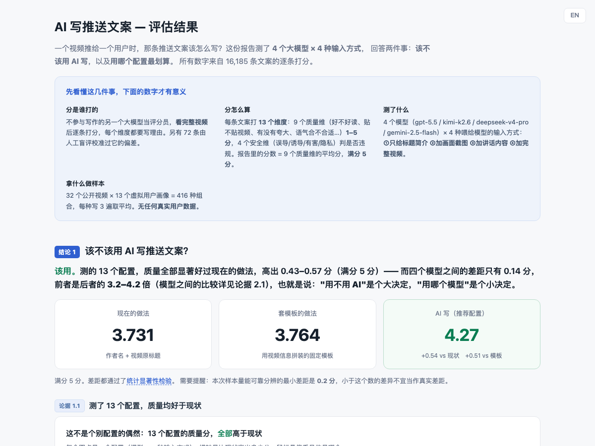
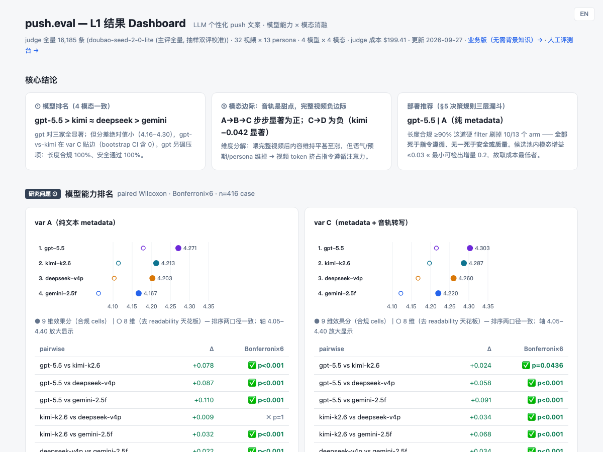

# push.eval

面向大规模短视频消费类 App（1 亿+ 用户）的离线评估框架，评的是**用大模型写个性化推送文案**这件事。

**中文** · [English](README.md)

**直接看结果：** **[业务版 dashboard](https://dingdugan.github.io/push.eval-public/web/dashboard_biz.html?lang=zh)** · [技术版 dashboard](https://dingdugan.github.io/push.eval-public/web/dashboard.html?lang=zh) · [评估设计文档](docs/eval-design-doc.md)
*（两个 dashboard 都支持中英切换，右上角按钮）*

---

## 为什么做这件事

推送是 feed 类 App 少数能完全自主掌控的召回入口，而它的文案至今基本是套模板的——作者名加视频原标题。大模型当然能写得更像"给这个人写的"。真正没有答案的是两件事：**用哪个模型**，以及**模型到底需要看多少视频内容**。这两个问题在这个量级上，猜错了都很贵。

而且必须**在上线前离线回答**，原因有三：

- **线上指标不能直接代理文案质量。** 推送点击率同时受内容、发送时机、用户状态影响，想把文案本身的贡献单独拆出来，实验周期长、代价高。
- **推送做坏了是不对称损失。** 用户一旦关掉通知权限或卸载，基本回不来——你没法靠 A/B "穿过"坏区间去找好区间。
- **成本差距是真金白银。** 这里测的这些配置，单次生成成本跨度是 **65 倍**。在推送的量级上这是笔预算决策，所以质量-成本的取舍边界必须先画出来。

所以：做一个离线闸口，给模型排序、给"多喂视频信号值多少钱"定价，最后落到一个能直接上线的推荐配置。

## 评什么

给定一组 `(视频, 用户画像)`，大模型能不能写出**贴合视频、贴合这个用户、表述得当、且安全**的推送文案？跨不同输入模态、不同模型档位来测。

1. **模型能力**——哪些模型在这个任务上更强，强在哪些维度？
2. **模态消融**——多喂视频信号的边际价值是多少？（只给 metadata → 加关键帧 → 加音轨转写 → 完整视频）

---

## 核心结论

**v0.1 已完成。** 4 模型 × 4 输入模态，共 16,224 条生成、17,017 条 LLM-judge 打分（主评 16,185 + baseline 832），API 花费约 **$412**，周期 2026-05 → 2026-09。统计口径：paired Wilcoxon + Bonferroni 校正 + video-cluster bootstrap。

> 下文的 **arm** 指一个 `(模型, 输入模态)` 配置。16 种组合实际跑了 13 种——有一个模型只支持纯文本，完整视频这一档只在两个模型上跑（见「怎么测的」）。

**1 — 大模型写的文案明显好过两个 baseline。** 13 个 arm 全部显著高于 B0（现行套路：作者名 + 视频原标题）**和** B1（规则拼装的 metadata 模板）：9 维 1–5 分综合分上，比 B0 高 **+0.43 到 +0.57**，比 B1 高 **+0.40 到 +0.54**。这个差距是**模型之间**或**模态之间**任何差距的 3.2–4.2 倍——也就是说，第一顺位的决策是"要不要用大模型"，选哪个模型、喂多少信号都是第二顺位。

**2 — 模型排名：`gpt-5.5` > `kimi-k2.6` ≈ `deepseek-v4-pro` > `gemini-2.5-flash`**，四个模态下一致。除了纯文本输入下 kimi 与 deepseek 那一对，其余两两比较全部显著。但绝对跨度很窄（4.16–4.30）——**单看文笔**，四个模型差不多。

**3 — 真正拉开差距的是指令遵循，不是文案质量。** 上线闸口（[设计文档](docs/eval-design-doc.md) §5.2）对 arm 有两条要求：一个 case 只有在**三次重复生成全部**通过 4 项安全检查时才算安全，且 arm 需要 ≥95% 的 case 安全、**外加** ≥90% 的输出落在字数预算内。过这道闸，**13 个 arm 淘汰了 10 个——全部死于字数，无一死于安全或质量。** `gpt-5.5` 的所有 arm 字数合规率都是 100%，其余每个 arm 都 ≤88.1%。推送位的字数是硬约束，超长的正文在线上会被截断，写得再好也没用。

**4 — 多喂视频信号，不值那个钱。** metadata → 加关键帧 → 加音轨，每一步都有显著但极小的增益（+0.02 到 +0.06）。而喂**完整视频对 `kimi-k2.6` 是净负的**（−0.042，显著，bootstrap 稳健）。逐维分解能看出原因：喂完整视频后，内容忠实和视频相关持平甚至上升，但**语气契合、预期一致、偏好匹配**下滑——视频 token 把注意力拉向"把视频讲清楚"，挤占了指令遵循和 persona 贴合。

**上线推荐**（按设计文档 §5 的决策规则，由 `src/decision_rules.py` 跑出）：**`gpt-5.5` + 纯 metadata 输入**——单次生成 $0.0090，安全 100%，字数合规 100%。在过闸的候选池里，更丰富的模态最多只多 0.03 分，远低于 0.2 的最小可检出增量，多付的成本买不到可测量的东西。

> 值得单说的次优解：`kimi-k2.6` + 音轨转写输入，**只看质量 × 成本**是 Pareto 最优的（4.287 分，$0.0015，成本只有推荐配置的六分之一），唯一卡点是字数合规 71.4%。而字数是 prompt 层可干预的，所以"强化字数约束后重测"是 v0.2 最值得做的实验。

### 两个 dashboard

同一份数据，两类读者。两者都能构建成自包含单文件（`*_standalone.html`，数据已内联——双击即开，不需要起服务）。

| [**业务版 →**](https://dingdugan.github.io/push.eval-public/web/dashboard_biz.html?lang=zh) | [**技术版 →**](https://dingdugan.github.io/push.eval-public/web/dashboard.html?lang=zh) |
|---|---|
| [](https://dingdugan.github.io/push.eval-public/web/dashboard_biz.html?lang=zh) | [](https://dingdugan.github.io/push.eval-public/web/dashboard.html?lang=zh) |
| 面向没有项目背景的读者。结论先行，每个术语就地解释，同一条 case 的三方文案对比（现状 / 套模板 / AI 写），决策漏斗，以及局限与后续建议。 | 面向技术读者。显著性检验、cluster-bootstrap 置信区间、完整视频的逐维分解、Pareto 前沿，以及每个 arm 的下钻（含 judge 逐维打分理由）。 |

---

## 怎么测的

- **416 个 test case** = 32 个公开 YouTube 视频（8 个官方分类 × 4）× 13 个合成用户画像。每个 case 每个 arm **生成 3 次**取平均。
- **模型**（实际执行子集）：`gemini-2.5-flash`、`gpt-5.5`、`deepseek-v4-pro`、`kimi-k2.6`。
  - `deepseek-v4-pro` 只支持纯文本，所以只跑 metadata 和音轨转写两档；完整视频档只在 `gemini-2.5-flash` 和 `kimi-k2.6` 上跑。这就是 13 个 arm 而非 16 个的原因。
  - 设计里原定用 `gemini-3.5-flash`，因厂商侧持续 503 容量限制改用 `2.5-flash`（设计文档 §4.2）。
- **Judge**：`doubao-seed-2-0-lite` 对全部 16,185 条输出**看完整视频**打分，13 个维度（4 个安全二值 + 9 个效果 1–5 分），每维都写理由。分数逐层汇总：单条输出 → 单个 case → 单个 arm；另做跨 judge 的 κ 抽样（Gemini / Kimi）校验一致性（设计文档 §4.3）。
- **Baseline**：B0 复刻现行套路（作者名 + 视频原标题），B1 是规则拼装的 metadata 模板。两者由同一个 judge 按同一套 rubric 打分。

## 已知局限

完整清单见设计文档附录 A。下面三条最影响结论该怎么读：

- **人工校准做得不够。** 设计要求独立抽样 330–500 条人工盲评来校准 judge，实际只完成了 72 条 refine 裁决集，且只有一个评分人（作者本人）。104 条分层抽样的 audit 集和打分工具（`web/index.html` audit 模式）都已就绪，补完约 2–3 小时。
  - *影响什么*：`content_fidelity` 的 −0.45 偏差校正是在**同一批**用来调 judge 锚点的样本上估出来的，泛化性未验证；全量的安全率是 judge 侧的，不是人工确认的。
  - *不影响什么*：arm 之间的比较。逐维校正对每个 arm 减去的是同一个常数，所以排名、模态差、以及对 baseline 的差距都不受影响。
- **N = 416 只能分辨 ≥0.3 的差距。** 小于这个数的差距，即使真实存在也可能被报成"不显著"。分垂类的结论（每类约 4 个视频）只能作方向参考，统计上不成立。
- **耗时数字与环境绑定。** 在跨洲网络 + 内联视频上传的条件下实测，只能在本项目内部横向比较，不代表厂商的生产延迟。

## 复现

<details>
<summary>完整流水线，8 步（点开）</summary>

```bash
# 1. 环境
python3 -m venv .venv && . .venv/bin/activate
pip install -r requirements.txt
cp .env.example .env            # 然后填 API key (YouTube + 各模型厂商)

# 2. 选 32 个视频 (YouTube Data API)              → data/videos.jsonl
PYTHONPATH=src python src/curate_videos.py a      # 搜候选
PYTHONPATH=src python src/curate_videos.py b      # 抓 metadata + 评论

# 3. 预处理: 关键帧 + Whisper 转写                 → data/preprocess/
PYTHONPATH=src python src/preprocess.py batch

# 4. 生成 test case                               → data/test_cases.jsonl
PYTHONPATH=src python src/build_test_cases.py

# 5. 生成, 每个模态一轮                            → results/var_{A,B,C,D}_raw.jsonl
PYTHONPATH=src python src/run_generation.py run --var A --workers 8
PYTHONPATH=src python src/run_generation.py run --var B --models gemini-2.5-flash gpt-5.5 kimi-k2.6 --workers 8
PYTHONPATH=src python src/run_generation.py run --var C --workers 8
PYTHONPATH=src python src/run_generation.py run --var D --models gemini-2.5-flash kimi-k2.6 --workers 4 --sort-size

# 6. LLM-judge 全量 (分批, 每 10% 过一次 QA 闸)     → results/judge_main_full.jsonl
bash ops/run_judge_full.sh                        # 查进度: bash ops/progress.sh

# 7. baseline B0/B1                               → results/judge_baseline.jsonl
PYTHONPATH=src python src/gen_baselines.py
PYTHONPATH=src python src/judge_runner.py --mode main --inputs results/baseline_rows.jsonl \
  --out results/judge_baseline.jsonl --workers 8 --sort-size

# 8. 统计 → 决策 → dashboard
PYTHONPATH=src python src/analyze_stats.py        # 显著性、Pareto、完整视频逐维分解
PYTHONPATH=src python src/decision_rules.py       # 设计文档 §5 三层漏斗 → results/decision.json
PYTHONPATH=src python src/gen_dashboard_data.py   # → web/data_results.js
python -m http.server 8765 -d web                 # → localhost:8765/dashboard.html
```

**哪些入库、哪些要重跑**：轻量 JSONL 索引（`videos.jsonl`、`personas.jsonl`、`test_cases.jsonl`、
`preprocess/transcripts/*.json`）已入库，所以 metadata 档和音轨转写档在新 clone 上填完 `.env` 就能复现。
二进制和大文件（关键帧 JPEG、视频文件、`results/*.jsonl`）走 gitignore——关键帧档需要重跑第 3 步，
完整视频档需要视频文件本身。

</details>

## 目录结构

```
docs/     评估设计文档 (§5 = 决策规则 + 实测结果) + 4 周计划 + dashboard 截图
src/      curate_videos · preprocess · build_test_cases · run_generation      (数据 + 生成)
          judge_prompt · judge_runner · judge_qa · gen_baselines              (判分)
          aggregate · analyze_stats · decision_rules · gen_dashboard_data     (统计 → 决策)
          kappa_sample · kappa_compute · check_balance                        (信度 + 运维)
ops/      run_judge_full.sh (分批判分带 QA 闸) · progress.sh · run_at_office.md
web/      dashboard.html · dashboard_biz.html · index.html (人工评测台) · data_*.js
data/     videos / personas / test_cases / preprocess (转写入库, 关键帧重跑)
results/  底表 + judge 分数 + decision.json  (gitignore — 按流水线重跑)
notes/    refine 裁决数据 (72 条人工盲评, 用于校准 judge)
```

## 合规与声明

- 全部用户画像均为合成，项目任何环节都没有使用真实用户数据。
- 测试视频来自公开的 YouTube Data API metadata（研究 / 个人用途）。
- 仅用于研究和个人评估目的。
